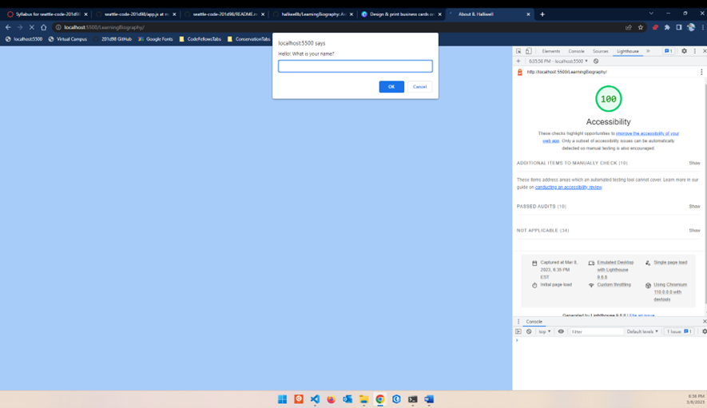

# Labs for week one code-201

## LearningBiography

This project asks questions so the user can learn more about the owner of the webpage. Next is a "guess a number" sequence between 1-20, offering six trys. Finally is a "guess my age" game offering four trys and alerting the user whether their guess is too high or too low, as well as how many trys they have remaining. All of the questions and prompts are wrapped in functions with the goal of reusability.

HTML, CSS, and JavaScript are used in this project.

### Author: Ben Halliwell

### Contributor: Kaeden O.

### Links and Resources

Line 26 - [Picture credit: B. Halliwell](https://beehoppyflowers.com/)

Line 46 - [Picture credit: Cameron Shepherd; Lewis Pugh Foundation](https://lewispughfoundation.org/)

### Lighthouse Accessibility Report Score

#### Score for Lab 2

#### Score for Lab 3

